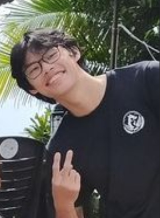

# About Us

We are a team based in the [School of Computing, National University of Singapore](http://www.comp.nus.edu.sg).

You can reach us at the email `seer[at]comp.nus.edu.sg`

## Project team

### Andrew Yapp

[[github](https://github.com/rocketninja7)]
[[portfolio](team/rocketninja7.md)]

- Role: Project Advisor

### Marques Tye

[[github](http://github.com/marquestye)]
[[portfolio](team/marquestye.md)]

- Role: Team Lead
- Responsibilities: UI

### Wong Ji Kean

[[github](http://github.com/ji-just-ji)]
[[portfolio](team/johndoe.md)]

- Role: Developer
- Responsibilities: Data

### Kyle Zheng Ching Chan

[[github](https://github.com/xCOLOURx)]
[[portfolio](team/xcolourx.md)]

- Role: Developer
- Responsibilities: Model + Ui

### Huan Yaohong

[[github](http://github.com/yyyaohhh)]
[[portfolio](team/yyyaohhh.md)]

- Role: Developer
- Responsibilities: UI
