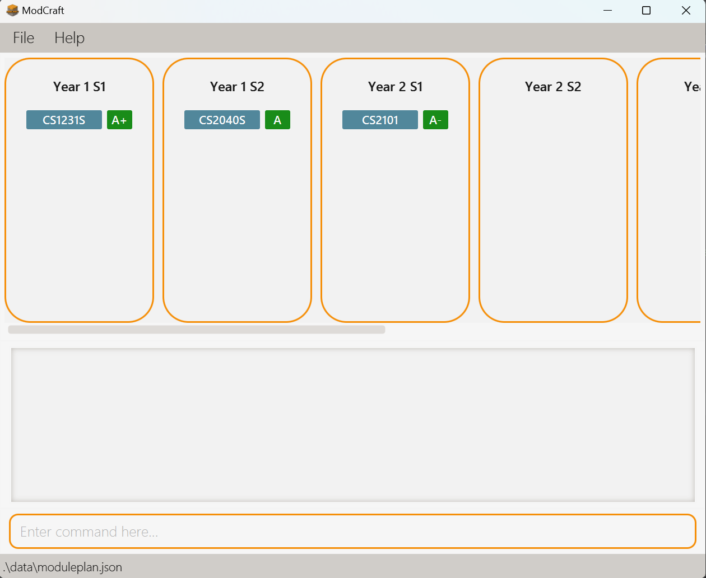
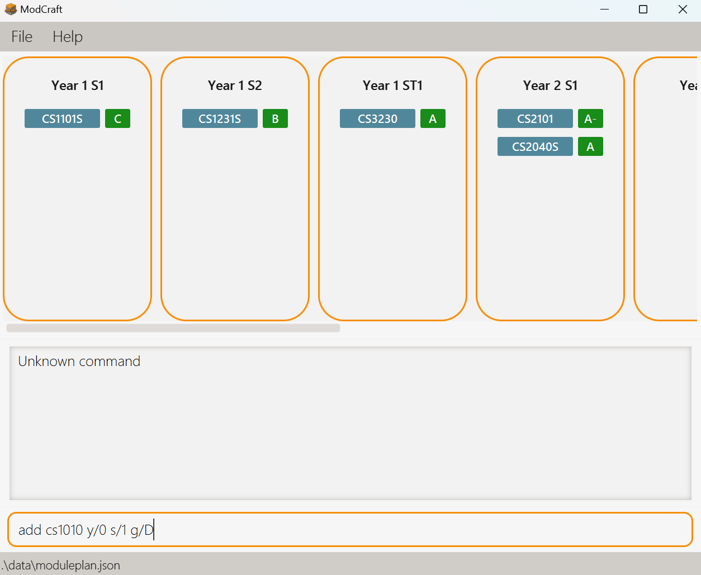
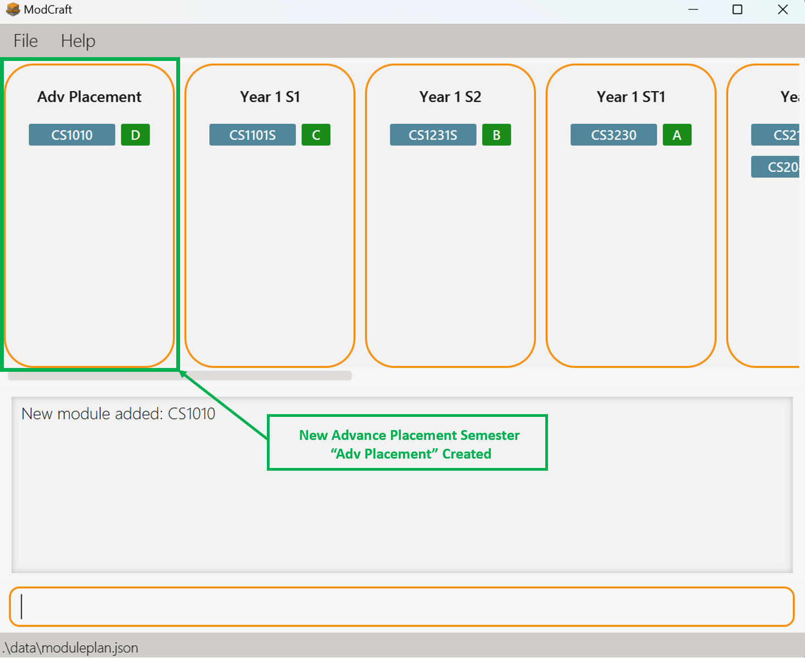
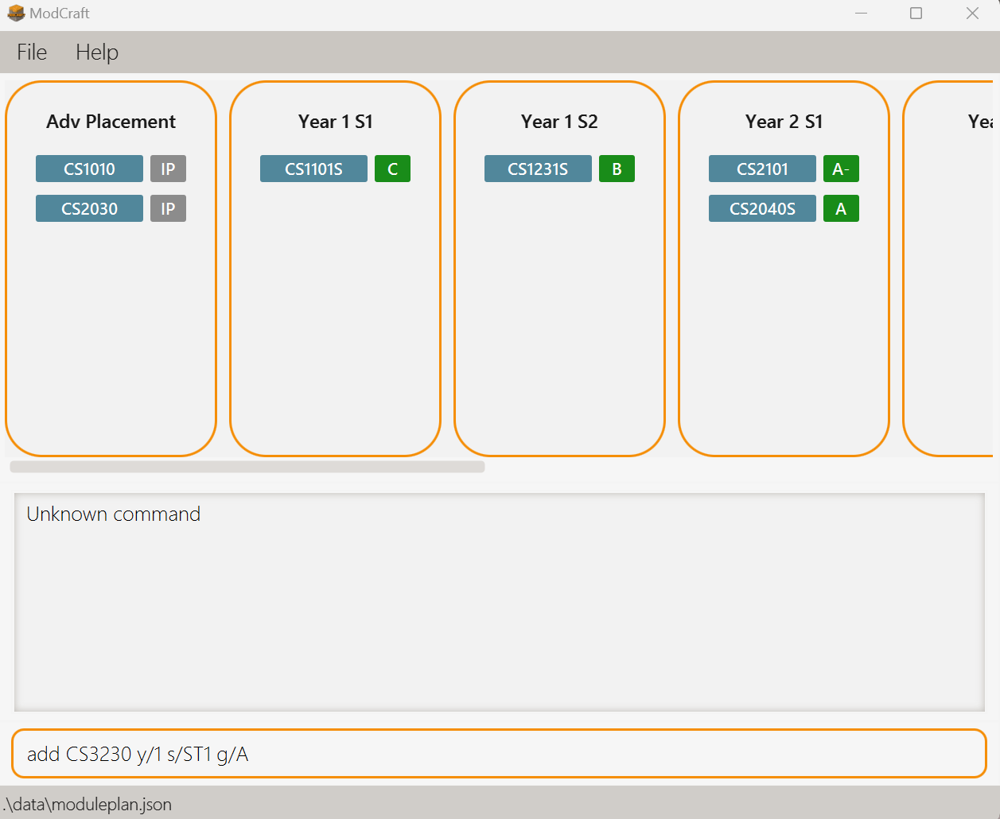
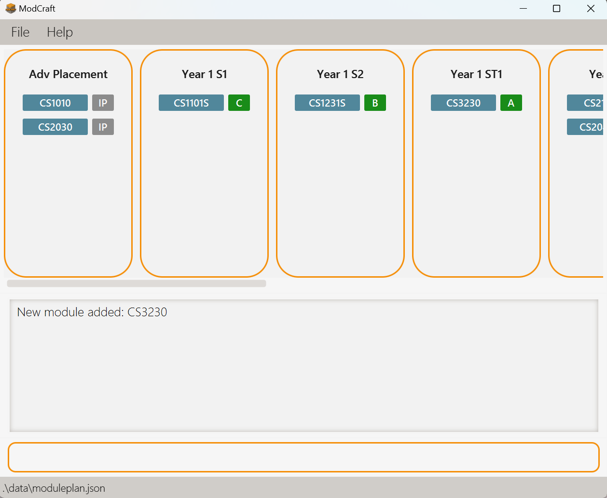
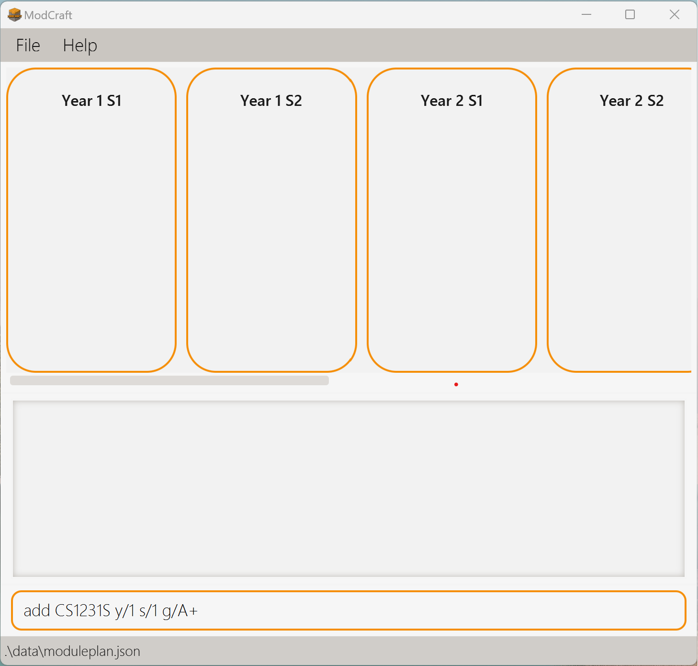
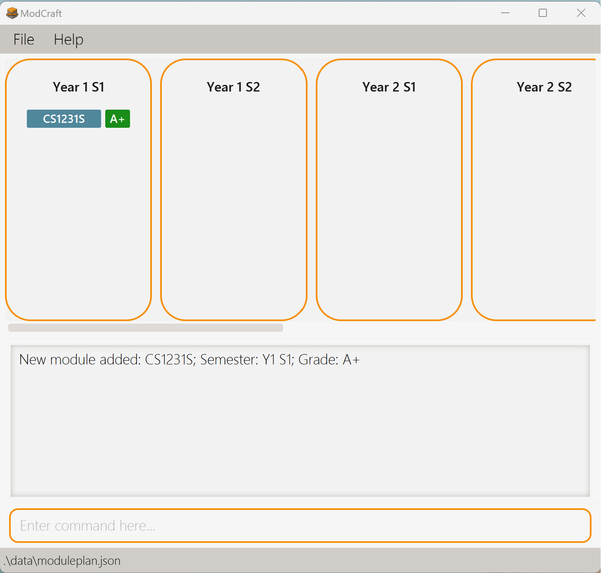
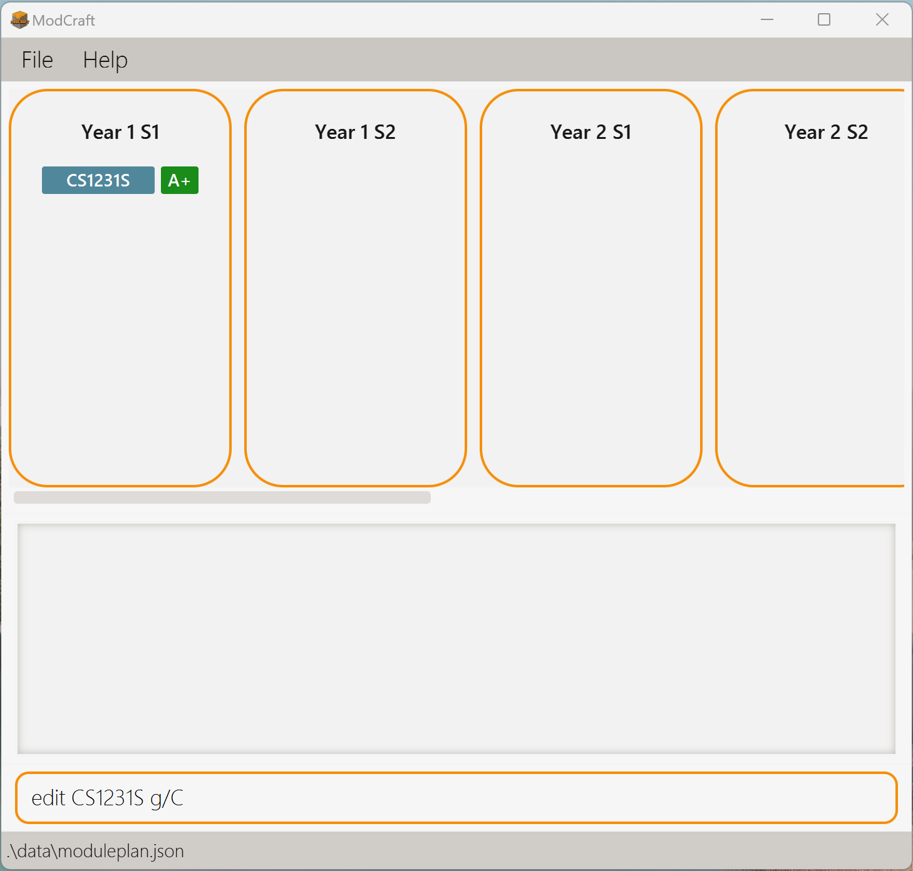
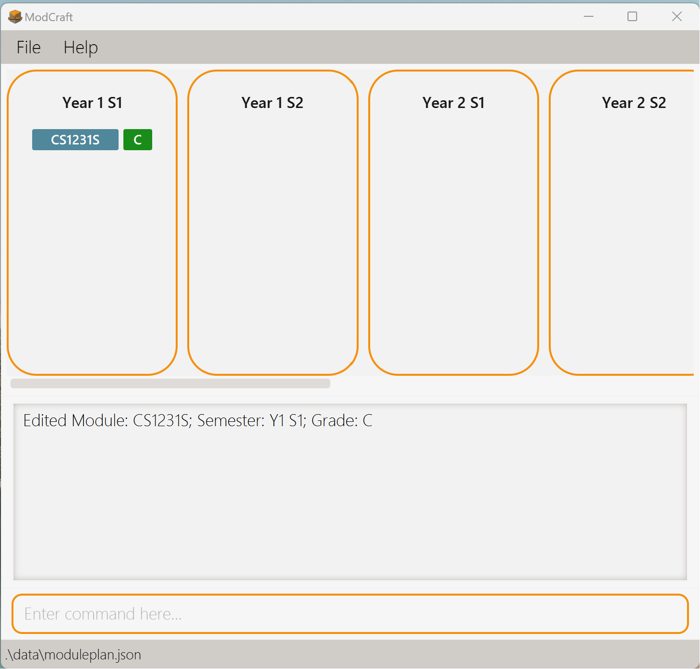
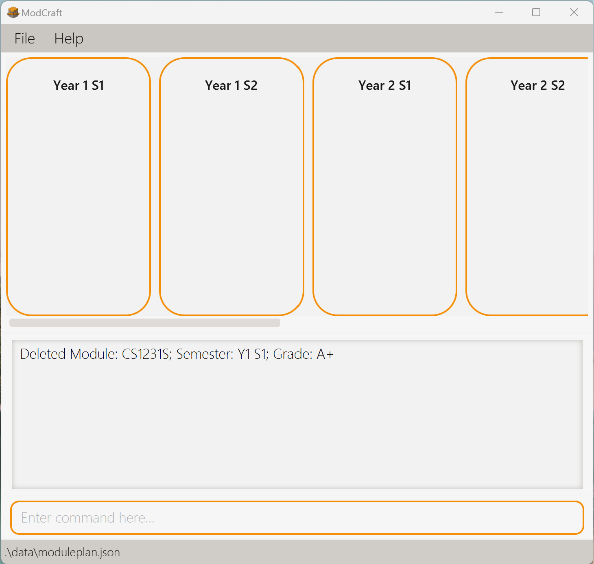

# ModCraft User Guide
--------------------------------------------------------------------------------------------------------------------

<!-- * Table of Contents -->
<page-nav-print />

ModCraft is a desktop application built for students from National University of Singapore (NUS) to help them **track and organise their academic journey**. With ModCraft serving as your **personal study planner**, you can easily:

* Keep track of the courses you have taken
* Plan ahead to fufill graduation requirements
* Continously adjust your study plan to new changes

And much more!

ModCraft streamlines the stressful process of course planning by providing a seamless user experience. It is tailored for efficiency through a Command Line Interface (CLI), complemented by the convenience of a Graphical User Interface (GUI) developed using JavaFX.

## Using this Guide

This User Guide provides a guide of how to set up ModCraft and a description of useful commands to use. If you are a **beginner**, we recommend that you start with the [Quick start](#quick-start) guide. Otherwise, feel free to explore the various features from the [Table of Contents](#table-of-contents) below.

This User Guide consists of various visuals to aid your reading.

<div class="alert alert-success"><md>:information_source: **Note:**
Notes in boxes like this provide you with information that is useful to know.
</md></div>

<div class="alert alert-primary"><md>:bulb: **Tip:**
Tips in boxes like this contain recommendations for users to consider.
</md></div>

<div class="alert alert-warning"><md>:gear: **Example:**
Examples in boxes like this show you possible ways a command can be run.
</md></div>

<div class="alert alert-danger"><md>:exclamation: **Caution:**
Warnings in boxes like this contain information that are vital to the running of the application. Ensure that you take special note of these warnings to prevent unexpected behaviour.
</md></div>

<br>

--------------------------------------------------------------------------------------------------------------------
## Table of Contents

1. [Quick start](#quick-start)
2. [Features](#features)
   * [Viewing help](#viewing-help-help)
   * [Modules](#modules)
     * [Adding a module](#adding-a-module-add)
     * [Editing a module](#editing-a-module-edit)
     * [Deleting a module](#deleting-a-module-delete)
     * [Finding information about a module](#finding-information-about-a-module-info)
   * [Calculating the total current CAP](#calculating-the-total-current-cap-calculatecap)
   * [Calculating the total current Modular Credits (MCs)](#calculating-the-total-current-modular-credits-mcs-calculatemc)
   * [Exiting the program](#exiting-the-program-exit)
3. [Advanced Use](#advanced-use)
   * [Editing the data file](#editing-the-data-file)
4. [FAQ](#faq)
5. [Known issues](#known-issues)
6. [Command summary](#command-summary)
7. [Glossary](#glossary)

<br>

--------------------------------------------------------------------------------------------------------------------

## Quick start

1. Ensure you have Java 11 or above installed in your Computer.
   * To do this, open a command terminal and type `java --version`.
   * If you do not have Java 11 installed, get it [here](https://www.oracle.com/sg/java/technologies/javase/jdk11-archive-downloads.html). <br>
2. Download the latest `ModCraft.jar` from [here](https://github.com/AY2324S1-CS2103T-T13-0/tp/releases/tag/v1.4).
3. Copy the downloaded jar file to the folder you want to use as the _home folder_ (the folder `ModCraft.jar` will be in) for ModCraft.


<div class="alert alert-danger"><md>:exclamation: **Caution:**
As ModCraft writes to files within the directory it is in, we recommend placing ModCraft in an empty directory to prevent unexpected behaviour.
</md></div>

4. Open a command terminal, `cd` into the folder you put the jar file in, and use the `java -jar ModCraft.jar` command to run the application. A GUI similar to below should appear in a few seconds. Note how the app contains some sample data.<br> <br>
   


5. Type the command in the command box and press Enter to execute it. e.g. typing `help` and pressing Enter will open the help window.<br>
   Some example commands you can try:

    * `info CS1101S` : Shows you the module code, module title, modular credit and description of the module `CS1101S`.

    * `add CS2030S y/1 s/2 g/IP` : Adds the module CS2030S to Year 1 Semester 2 of your study plan, with an `IP` (In Progress) grade.

    * `delete CS2040S` : Deletes the module CS2040S if it is present from your list of modules taken.

    * `exit` : Exits ModCraft.

6. You can refer to the [Features](#features) section below for details of each command.

<br>

[&uarr; Back to Table of Contents](#table-of-contents)

--------------------------------------------------------------------------------------------------------------------

## Features

<br>

<div class="alert alert-success"><md>:information_source: **Note:** For the command format:<br>

* All commands are **case-sensitive**.

* Words in `UPPER_CASE` are **compulsory parameters** supplied by you.<br>
  e.g. in `delete MODULE`, `MODULE` is a parameter which can be used as `delete CS1231S`.

* Parameters in square brackets denote **optional parameters**.<br>
  e.g. `edit [y/YEAR]` means that specifying `y/YEAR` is optional. However, if you keyed in `y/`, `YEAR` has to be specified.

* Extra parameters for commands that do not take in parameters (such as `help` and `exit`) will be **ignored**.<br>
  e.g. if you input `help 123`, it will be interpreted as `help`.

* Parameters can either come with a **prefix** (like `y/` in `y/YEAR`) or **without a prefix** (like `MODULE`).

* All commands will have **at most one** parameter without a prefix. Parameters without a prefix should come **before** any parameters with a prefix. ModCraft will parse all your input between the command and the first prefix as **one parameter**.<br>
  e.g. For `add MODULE y/YEAR s/SEM g/GRADE`, when you key in `add CS2101 CS2103T y/1 s/1 g/A`, ModCraft will read it as you trying to specify `CS2101 CS2103T` as one `MODULE`.

* Parameters with a prefix can be specified in **any order** among themselves.<br>
  e.g. `add CS2030S y/1 s/2 g/IP` is the same as `add CS2030S s/2 g/IP y/1`.

</md></div>

<br>

### Viewing help: `help`

Displays to you a popup explaining how to access the User Guide of ModCraft, as shown below.


You can copy the URL using the `Copy URL` button and paste it into your browser to view [this User Guide](https://ay2324s1-cs2103t-t13-0.github.io/tp/UserGuide.html) about setting up ModCraft and the descriptions of commands in ModCraft.

**Format:**
```
help
```

<br>

[&uarr; Back to Table of Contents](#table-of-contents)

--------------------------------------------------------------------------------------------------------------------

### <span style="text-decoration:underline">Modules</span>

The modules in ModCraft are [courses from National University of Singapore (NUS)](https://nusmods.com/courses?sem[0]=1&sem[1]=2&sem[2]=3&sem[3]=4). The modules have **Module Code**, **Module Title**, **Module Description** and **Modular Credits**.

<div class="alert alert-warning"><md>:gear: **Example:**

* Module Code: `CS2040S`
* Module Title: `Data Structures and Algorithms`
* Module Description: `This course introduces the fundamentals of data structures and algorithms.`
* Modular Credits: `4`
</md></div>

<div class="alert alert-success"><md>:information_source: **Note:**
The Module Code, Module Title, Module Description and Modular Credits **cannot** be edited.
</md></div>

<br>

In ModCraft, you can specify the **Year**, **Semester** and **Grade** of each module when you are adding or editing your study plan.


|           Parameter           | Values/Format                                                                                                                                                                                                                                                                                                                                                                                                                                                                                                                                                                                                                                                                                                                                                                                                                                                                                                                                                                                                                                                                                                                                                                                                           |
|:-----------------------------:|-------------------------------------------------------------------------------------------------------------------------------------------------------------------------------------------------------------------------------------------------------------------------------------------------------------------------------------------------------------------------------------------------------------------------------------------------------------------------------------------------------------------------------------------------------------------------------------------------------------------------------------------------------------------------------------------------------------------------------------------------------------------------------------------------------------------------------------------------------------------------------------------------------------------------------------------------------------------------------------------------------------------------------------------------------------------------------------------------------------------------------------------------------------------------------------------------------------------------|
|     **Year**<br>`y/YEAR`      | Number from `0` to `6` <br> * `0` represents Advance Placement                                                                                                                                                                                                                                                                                                                                                                                                                                                                                                                                                                                                                                                                                                                                                                                                                                                                                                                                                                                                                                                                                                                                                          |
| **Semester**<br>`s/SEMESTER`  | - `1`&nbsp;&nbsp;&nbsp;&nbsp;&nbsp;&nbsp;&nbsp;(Semester 1)<br>- `2`&nbsp;&nbsp;&nbsp;&nbsp;&nbsp;&nbsp;&nbsp;(Semester 2)<br>- `ST1`&nbsp;&nbsp;&nbsp;(Special Term 1)<br>- `ST2`&nbsp;&nbsp;&nbsp;(Special Term 2) 	                                                                                                                                                                                                                                                                                                                                                                                                                                                                                                                                                                                                                                                                                                                                                                                                                                                                                                                                                                                                  |                                                                                                                                                                                                |
|    **Grade**<br>`g/GRADE`     | The Grades follow the [NUS Modular System](https://www.nus.edu.sg/registrar/academic-information-policies/undergraduate-students/modular-system).<br><br>- `A+`&nbsp;(5.0)&nbsp;&nbsp;&nbsp;&nbsp;&nbsp;&nbsp;&nbsp;&nbsp;- `IP`&nbsp;&nbsp;&nbsp;&nbsp;(In Progress)<br>- `A`&nbsp;&nbsp;&nbsp;(5.0)&nbsp;&nbsp;&nbsp;&nbsp;&nbsp;&nbsp;&nbsp;&nbsp;- `EXE`&nbsp;&nbsp;(Exempted)<br>- `A-`&nbsp;(4.5)&nbsp;&nbsp;&nbsp;&nbsp;&nbsp;&nbsp;&nbsp;&nbsp;- `W`&nbsp;&nbsp;&nbsp;&nbsp;&nbsp;&nbsp;(Withdrawn)<br>- `B+`&nbsp;(4.0)&nbsp;&nbsp;&nbsp;&nbsp;&nbsp;&nbsp;&nbsp;&nbsp;- `IC`&nbsp;&nbsp;&nbsp;&nbsp;(Incomplete)<br>- `B`&nbsp;&nbsp;&nbsp;(3.5)&nbsp;&nbsp;&nbsp;&nbsp;&nbsp;&nbsp;&nbsp;&nbsp;- `S`&nbsp;&nbsp;&nbsp;&nbsp;&nbsp;&nbsp;(Satisfactory)<br>- `B-`&nbsp;(3.0)&nbsp;&nbsp;&nbsp;&nbsp;&nbsp;&nbsp;&nbsp;&nbsp;- `U`&nbsp;&nbsp;&nbsp;&nbsp;&nbsp;&nbsp;(Unsatisfactory)<br>- `C+`&nbsp;(2.5)&nbsp;&nbsp;&nbsp;&nbsp;&nbsp;&nbsp;&nbsp;&nbsp;- `CS`&nbsp;&nbsp;&nbsp;&nbsp;(Completed Satisfactory)<br>- `C`&nbsp;&nbsp;&nbsp;(2.0)&nbsp;&nbsp;&nbsp;&nbsp;&nbsp;&nbsp;&nbsp;&nbsp;- `CU`&nbsp;&nbsp;&nbsp;&nbsp;(Completed Unsatisfactory)<br>- `D+`&nbsp;(1.5)<br>- `D`&nbsp;&nbsp;&nbsp;(1.0) |


<div class="alert alert-success"><md>:information_source: **Note:** For the parameters in the table above <br>

* `g/GRADE` and `s/SEMESTER` are **case-sensitive parameters**. Only grades and semesters in **capital letters** are allowed.<br>
  e.g. `g/A` instead of `g/a`, and `s/ST1` instead of `g/st1`.

* There is **only one** Advance Placement semester and whenever `y/0` is entered, **regardless of the semester** entered, the module will be added or edited to the Advance Placement Semester.

* The list for the Advance Placement semester, Year 5 and Year 6 semesters, and Special Terms 1 and 2 (ST1 and ST2) will only be displayed when there is a **module within them**.

</md></div>

<br>

The images below show you the process for adding a module to the Advance Placement semester in ModCraft. The module `CS1010` is being added to Year 0 (the Advance Placement semester).

<div style="display:flex; justify-content:space-around; align-items:center;">
  <figure>
    
    <figcaption style="text-align: center;">Before</figcaption>
  </figure>
  <figure>
    
    <figcaption style="text-align: center;">After</figcaption>
  </figure>
</div>

<br>

The images below show you the process for adding a module to one of the Special Term (ST) in ModCraft. The module `CS3230` is being added to Year 1, Special Term 1.

<div style="display:flex; justify-content:space-around; align-items:center;">
  <figure>
    
    <figcaption style="text-align: center;">Before</figcaption>
  </figure>
  <figure>
    
    <figcaption style="text-align: center;">After</figcaption>
  </figure>
</div>


<div class="alert alert-danger"><md>:exclamation: **Caution:**
Currently, ModCraft has certain **limitations**.

* ModCraft **does not** check for pre-requisites, pre-clusions and co-requisites while adding, deleting and editing modules. This means that you can add modules into ModCraft without adding their prerequisite modules.

* ModCraft **does not** check for availability of modules for semesters. This means that you can add any module into any semester of your study plan, even though the module may not be offered in that semester.

* ModCraft **does not** check for the availability of CS/CU options of modules, this means that you can add a non-CS/CU module with a CS/CU grade.<br>
e.g. you can add the non-CS/CU module `CS2100` and input its grade as `CS`.<br>
Likewise, you can add a CS/CU module with a non-CS/CU grade.<br>
e.g. you can mark the grade of `CFG1002` as `A`.

* ModCraft **does not** check for the availability of S/U options of modules, this means that you can input the grade of a module as `S` or `U` even though the module **does not have the S/U option**.<br>
e.g. you can add the non-S/U module `CS3230` and input its grade as `S`.

These features are [planned enhancements](https://ay2324s1-cs2103t-t13-0.github.io/tp/DeveloperGuide.html#future-enhancements) in future releases.

</md></div>

<br>

[&uarr; Back to Table of Contents](#table-of-contents)

--------------------------------------------------------------------------------------------------------------------

### Adding a module: `add`

You can add a module to your study plan of the list of modules taken in the specified **year** and **semester** with the specified **grade** using this command.

**Format:**
```
add MODULE y/YEAR s/SEM g/GRADE
```

<div class="alert alert-warning"><md>:gear: **Example:**

* `add MA1521 y/1 s/1 g/A`: Adds the module MA1521 to Year 1 Semester 1 with grade A.
* `add CFG1002 y/1 s/2 g/CS`: Adds the module CFG1002 to Year 1 Semester 2 with grade CS.
* `add ST2334 y/2 s/1 g/IP`: Adds the module ST2334 to Year 2 Semester 1 with grade IP.
</md></div>

The images below show you the `add` command in action.

<div style="display:flex; justify-content:space-around; align-items:center;">
  <figure>
    
    <figcaption style="text-align: center;">Before</figcaption>
  </figure>
  <figure>
    
    <figcaption style="text-align: center;">After</figcaption>
  </figure>
</div>


<div class="alert alert-primary"><md>:bulb: **Tip:**

* To **plan ahead** using ModCraft, you can input `IP` as `GRADE`.

* For modules with a **S/U** grade, you can input `S` or `U` as `GRADE`.
</md></div>

<br>

[&uarr; Back to Table of Contents](#table-of-contents)

--------------------------------------------------------------------------------------------------------------------

### Editing a module: `edit`

You can change an attribute of a module using this command. This command works **only if the module has already been added**.

This command may be useful if you want to update information about a module or have made a mistake while adding a module.

**Format:**
```
edit MODULE [y/YEAR] [s/SEM] [g/GRADE]
```

<div class="alert alert-warning"><md>:gear: **Example:**

* `edit CS2030S g/A+`: Updates the grade of CS2030S to A+.
* `edit CS3230 y/4 s/2`: Moves CS3230 to the Year 4 Semester 2 module list.
* `edit CS2100 y/1`: Moves CS2100 to the Year 1 module list, with **Semester unchanged**.<br>
If before editing, the module was in Year 2 Semester 1, after editing it would be in Year 1 Semester 1.
* `edit CS2101 s/1`: Moves CS2101 to the Semester 1 module list, with **Year unchanged**.<br>
If before editing, the module was in Year 1 Semester 2, after editing it would be in Year 1 Semester 1.
</md></div>

The images below show you the `edit` command in action. The grade of `CS1101S` is being edited to `C`.

<div style="display:flex; justify-content:space-around; align-items:center;">
  <figure>
    
    <figcaption style="text-align: center;">Before</figcaption>
  </figure>
  <figure>
    
    <figcaption style="text-align: center;">After</figcaption>
  </figure>
</div>

<div class="alert alert-success"><md>:information_source: **Note:**
You need to provide **at least one** of the optional fields (i.e. `GRADE`, `YEAR`, `SEMESTER`).
</md></div>

<br>

[&uarr; Back to Table of Contents](#table-of-contents)

--------------------------------------------------------------------------------------------------------------------

### Deleting a module: `delete`

You can remove the module from whichever semester the module is taken using this command. This command works **only if the module has already been added**.

**Format:**
```
delete MODULE
```

<div class="alert alert-warning"><md>:gear: **Example:**

* `delete GEA1000`: Removes GEA1000 from the study plan.
</md></div>

The images below show you the `delete` command in action. The module `CS2101` is being deleted.

<div style="display:flex; justify-content:space-around; align-items:center;">
  <figure>
    
    <figcaption style="text-align: center;">Before</figcaption>
  </figure>
  <figure>
    
    <figcaption style="text-align: center;">After</figcaption>
  </figure>
</div>

<div class="alert alert-primary"><md>:bulb: **Tip:**

* If you are **dropping a module** and retaking it in later semesters, the module dropped should be **deleted** before adding the same module to another semester later on.

* ModCraft currently **does not support** retaking failed modules by keeping the failed module in the study plan and adding another copy of the same module for retake.

</md></div>

<div class="alert alert-danger"><md>:exclamation: **Caution:**
Deleting a module also **deletes all the information associated with the module**, such as grade, year and semester taken. This action is **irreversible!**

</md></div>

<br>

[&uarr; Back to Table of Contents](#table-of-contents)

--------------------------------------------------------------------------------------------------------------------

### Finding information about a module: `info`

You can retrieve information about **any** module by its Module Code using this command, including the modules **not yet added** to your study plan.

The **Module Code**, **Module Title**, **Modular Credit** and **Module Description** of the module will be displayed.

**Format:**
```
info MODULE
```

<div class="alert alert-warning"><md>:gear: **Example:**

* `info CS2109S`: Displays information about the module CS2109S.

</md></div>

The image below show you what ModCraft should look like after executing the `info` command.

<div style="display:flex; justify-content:space-around; align-items:center;">
  
</div>
<p style="text-align: center;">
    The command `info CS3230` is executed. Information about the module `CS3230` is displayed.
</p>

<div class="alert alert-success"><md>:information_source: **Note:** The module information is taken from [NUSmods](https://github.com/nusmodifications/nusmods) for the current Academic Year 23/24.
</md></div>

<br>

[&uarr; Back to Table of Contents](#table-of-contents)

--------------------------------------------------------------------------------------------------------------------

### Calculating the total current CAP: `calculateCAP`

You can calculate the total current Cumulative Average Point (CAP), or Grade Point Average (GPA) of all modules stored in all years and semesters, using this command.

ModCraft will calculate your CAP according to the [NUS Modular System](https://www.nus.edu.sg/registrar/academic-information-policies/non-graduating/modular-system), and using the following formula:


<p style="text-align: center;"><md>
$\Large\frac{\text{For each valid module: Sum of(Grade Point * Modular Credits)}}{\text{Total Modular Credits of valid modules}}$.
</md></p>

Displays you a `float` of `0.0` $\leq$ value $\leq$ `5.0`.

**Format:**
```
calculateCAP
```


Here is an example output after executing the `calculateCAP` command:

```
Calculated CAP: 3.75
```

<div class="alert alert-success"><md>:information_source: **Note:**
The result displayed by the `calculateCAP` command **does not include** the modules with grades marked as
`IP`, `EXE`, `W`, `IC`, `S`, `U`, `CS` and `CU`.
</md></div>

<br>

[&uarr; Back to Table of Contents](#table-of-contents)

--------------------------------------------------------------------------------------------------------------------

### Calculating the total current Modular Credits (MCs): `calculateMC`

You can calculate the total current Modular Credits (MCs) stored in **all** years and semesters using this command.
ModCraft displays a float which is the sum of MCs of **all modules** in the **study plan**.

**Format:**
```
calculateMC
```

Here is an example output after executing the `calculateMC` command:

```
Total Modular Credits: 16.0
```

<div class="alert alert-primary"><md>:bulb: **Tip:** The result displayed by the `calculateMC` command **includes** the modular credits of **all modules** in the study plan
regardless of the grade.
</md></div>

<br>

[&uarr; Back to Table of Contents](#table-of-contents)

--------------------------------------------------------------------------------------------------------------------

### Exiting the program: `exit`

You can exit ModCraft using this command.

**Format:**
```
exit
```

<br>

[&uarr; Back to Table of Contents](#table-of-contents)

--------------------------------------------------------------------------------------------------------------------

## Advanced use

ModuleList data is saved in the hard disk automatically after any command you inputted that changes the data.
There is no need for you to save manually. <br>

### Editing the data file

The module data is saved automatically as a JSON file `[JAR file location]/data/moduleplan.json`.

Advanced users are welcome to update data directly by editing that data file.
<div class="alert alert-danger"><md>:exclamation: **Caution:** If your changes to the data file makes its format invalid, ModCraft will **discard all data and start with a default data file** at the next run.  Hence, it is recommended to take a backup of the file before editing it.

</md></div>

<br>

[&uarr; Back to Table of Contents](#table-of-contents)

--------------------------------------------------------------------------------------------------------------------

## FAQ

| **Question**                                   | **Answer**                                                                                                                                                       |
|------------------------------------------------|------------------------------------------------------------------------------------------------------------------------------------------------------------------|
| How do I transfer my data to another Computer? | Install the app in the other computer and overwrite the default data file it creates with the file that contains the data of your previous ModCraft home folder. |
| How do I save the data?                        | The data is saved in the hard disk automatically after any command that changes the data.<br> There is no need to save manually.                                 |
| Where do I get support for ModCraft?           | You can raise an issue on our [GitHub repository](https://github.com/AY2324S1-CS2103T-T13-0/tp/issues).                                                          |
| How do I report a bug?                         | You can raise a bug report on our [GitHub repository](https://github.com/AY2324S1-CS2103T-T13-0/tp/issues).                                                      |
| How do I import my data from another software? | You can import your data by converting your data into JSON in the format of the `moduleplan.json` data in the data folder.                                       |
| How do I export my data to another software?   | It is currently not possible to export your data from ModCraft to another software.                                                                              |

<br>

[&uarr; Back to Table of Contents](#table-of-contents)

--------------------------------------------------------------------------------------------------------------------

## Known issues

1. **When using multiple screens**, if you move the application to a secondary screen, and later switch to using only the primary screen, the GUI will open off-screen. The remedy is to delete the `preferences.json` file created by the application before running the application again.
2. For issues related to **lack of features** such as checking for S/U option of a module, please refer to the **limitations of ModCraft** under the **caution warning box** in [Modules](#modules). These features are planned enhancements in future releases.

<br>

[&uarr; Back to Table of Contents](#table-of-contents)

--------------------------------------------------------------------------------------------------------------------

## Command summary

| Action           | Format, Examples                                                                                             |
|------------------|--------------------------------------------------------------------------------------------------------------|
| **help**         | `help`                                                                                                       |
| **add**          | `add MODULE_CODE y/YEAR s/SEMESTER g/GRADE`<br> e.g., `add CS2106 y/3 s/1 g/IP`                              |
| **edit**         | `edit MODULE_CODE [y/YEAR] [s/SEMESTER] [g/GRADE]` <br> e.g., `edit MA2001 y/1 s/2`, <br/> `edit MA2001 g/A` |
| **delete**       | `delete MODULE_CODE` <br> e.g., `delete CS2040S`                                                             |
| **info**         | `info MODULE_CODE`<br> e.g., `info CS3230`                                                                   |
| **calculateCAP** | `calculateCAP`                                                                                               |
| **calculateMC**  | `calculateMC`                                                                                                |
| **exit**         | `exit`                                                                                                       |

<br>

[&uarr; Back to Table of Contents](#table-of-contents)

--------------------------------------------------------------------------------------------------------------------

## Glossary

- **Command Line Interface (CLI)**: A display that allows you to type commands to interact with the application.
- **Graphical User Interface (GUI)**: A user-friendly display that allows you to see the effects of your actions in the application.
- **JSON**: stands for JavaScript Object Notation, a lightweight data-interchange format and a plain text written in JavaScript object notation, used to send data between computers.
- **Pre-requisite**: Pre-requisites indicate the base of knowledge on which the subject matter of a particular course will be built. Before taking a course, a student should complete any pre-requisite course(s) listed for that particular course.<br>
  Where pre-requisites are specified, equivalent courses will also be accepted. For more information on pre-requisites, please refer to [NUS's Modular System](https://www.nus.edu.sg/registrar/academic-information-policies/graduate/modular-system).
- **Pre-clusions**: Courses that have similar emphases and may not be taken together with that particular course.
- **Co-requisites**: Courses that are to be taken concurrently.
<br>

[&uarr; Back to Table of Contents](#table-of-contents)

--------------------------------------------------------------------------------------------------------------------
