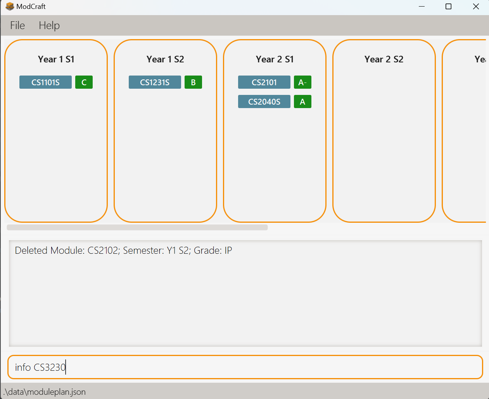
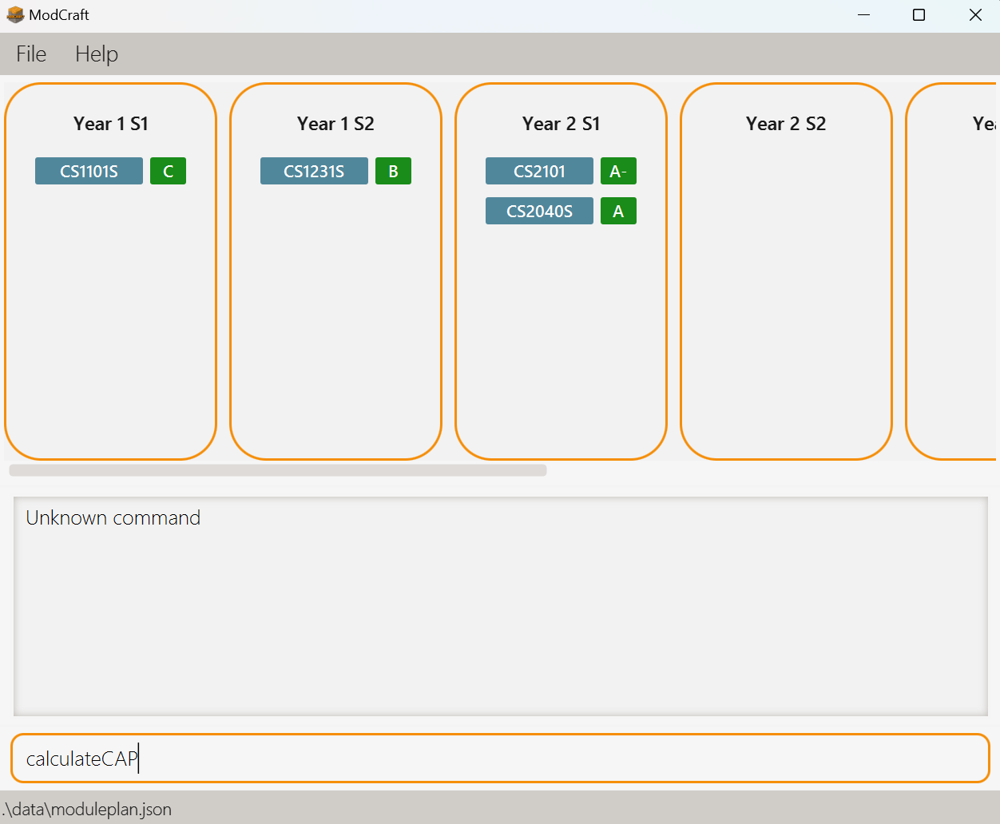
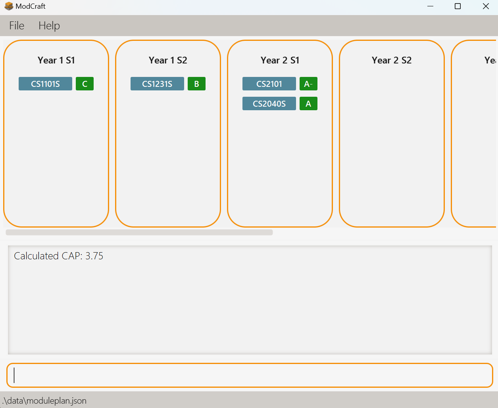
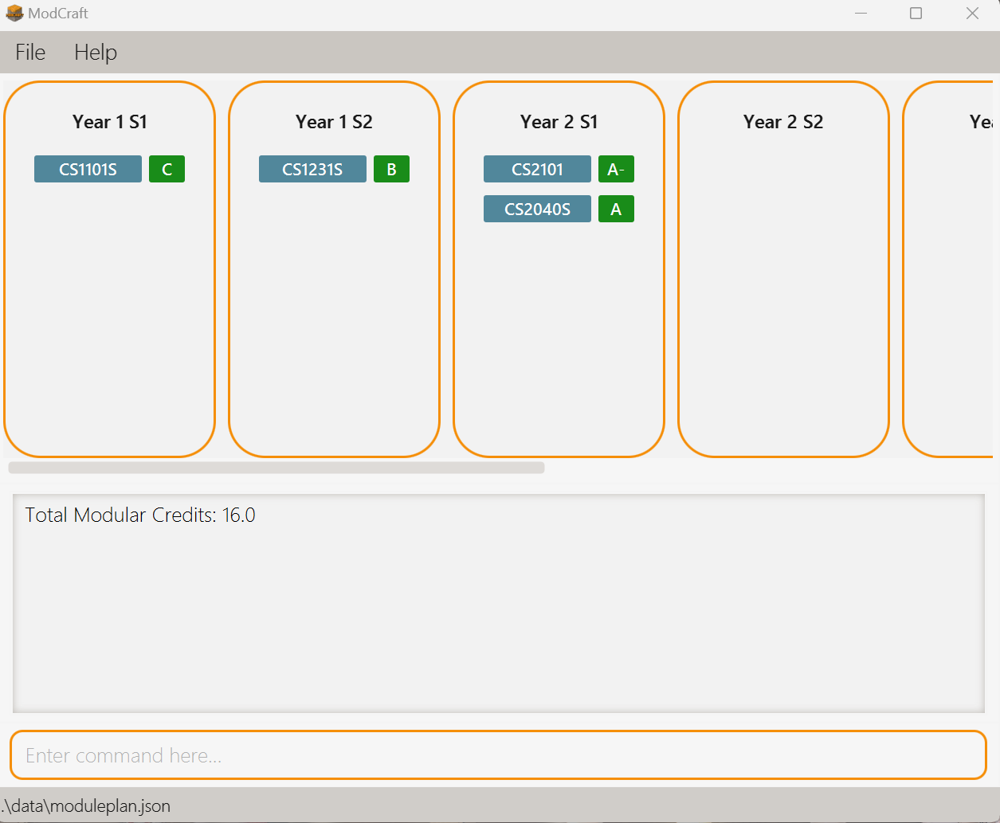

# ModCraft User Guide

<!-- * Table of Contents -->
<page-nav-print />

ModCraft is an app that provides a **fast and easy way** for Computer Science students from National University of Singapore (NUS) to **track courses to take to meet graduation requirements** and **plan courses to take**. You can interact
with it using a Command Line Interface (CLI), and it has a Graphical User Interface (GUI) created with JavaFX.

ModCraft can serve as a **study planner** for your journey in NUS. With ModCraft, you can easily:

* Add in modules you have taken
* Add in modules you plan to take
* Delete modules you would like to drop
* Update grades of your modules

**And many more!**

This User Guide provides a guide of how to set up ModCraft and a description of useful commands to use. If you are a beginner, we recommend that you start with the [Quick start](#quick-start) guide. Otherwise, feel free to explore the various features from the [Table of Contents](#table-of-contents) below.

This User Guide consists of various visuals to aid your reading. 

<md>:bulb: **Tip:**
Tips in boxes like this contain information that may be helpful.
</md>

<md>:exclamation: **Caution:**
Warnings in boxes like this contain information that are vital to the running of the application. Ensure that you take special note of these warnings to prevent unexpected behaviour.
</md>

<md>:information_source: **Note:**
Provides you with information that is useful to know.
</md>

--------------------------------------------------------------------------------------------------------------------
## Table of Contents

1. [Quick start](#quick-start)
2. [Features](#features)  
    2.1. [Viewing help](#viewing-help-help)  
    2.2. [Modules](#modules)  
      2.2.1. [Adding a module](#adding-a-module-add)  
      2.2.2. [Editing a module](#editing-a-module-edit)  
      2.2.3. [Deleting a module](#deleting-a-module-delete)  
      2.2.4. [Finding information about a module](#finding-information-about-a-module-info)  
    2.3. [Calculating the total current CAP](#calculating-the-total-current-cap-calculatecap)  
    2.4. [Calculating the total current Modular Credits (MCs)](#calculating-the-total-current-modular-credits-mcs-calculatemc)  
    2.5. [Exiting the program](#exiting-the-program-exit)
3. [Advanced Use](#advanced-use)  
    3.1. [Editing the data file](#editing-the-data-file)
4. [FAQ](#faq)
5. [Known issues](#known-issues)
6. [Command summary](#command-summary)
7. [Glossary](#glossary)

--------------------------------------------------------------------------------------------------------------------

## Quick start

1. Ensure you have Java 11 or above installed in your Computer.
    1. To do this, open a command terminal and type `java --version`.
    2. If you do not have Java 11 installed, get it [here](https://www.oracle.com/sg/java/technologies/javase/jdk11-archive-downloads.html).

2. Download the latest `ModCraft.jar` from [here](https://github.com/AY2324S1-CS2103T-T13-0/tp/releases/tag/v1.2b).

3. Copy the downloaded jar file to the folder you want to use as the _home folder_(the folder `ModCraft.jar` will be in) for your ModCraft.

4. Open a command terminal, `cd` into the folder you put the jar file in, and use the `java -jar ModCraft.jar` command to run the application. 
   A GUI similar to below should appear in a few seconds. Note how the app contains some sample data.   
   

5. Type the command in the command box and press Enter to execute it. e.g. typing **`help`** and pressing Enter will open the help window. 
   Some example commands you can try:

    * `info CS1101S` : Shows you information about the module CS1101S.

    * `add CS2030S y/1 s/2 g/IP` : Adds the module CS2030S to your study plan of semester 2 in year 1, and marks it as In Progress.

    * `delete CS2040S` : Deletes the module CS2040S if present from your list of modules taken.

    * `exit` : Exits the app.

6. You can refer to the [Features](#features) section below for details of each command.

--------------------------------------------------------------------------------------------------------------------

## Features

 

**Notes about the command format:** 

* All commands are **case-sensitive**.

* Words in `UPPER_CASE` are **compulsory parameters** to be supplied by the user. 
  e.g. in `delete MODULE`, `MODULE` is a parameter which can be used as `delete CFG1002`.

* Parameters in square brackets denote **optional parameters**. 
  e.g. `edit [y/YEAR]` means that specifying `y/YEAR` is optional. However, if `y/` is keyed in by the user, `YEAR` has to be specified.

* When passing in grades as parameters, the grades follow the [NUS Modular System](https://www.nus.edu.sg/registrar/academic-information-policies/undergraduate-students/modular-system).

* Grades and semesters as parameters are case-sensitive. Only grades and semesters in **capital letters** are allowed. For example, `g/A` instead of `g/a` and `s/ST1` instead of `g/st1`.

* Extraneous parameters for commands that do not take in parameters (such as `help` and `exit`) will be ignored. 
  e.g. if the command specifies `help 123`, it will be interpreted as `help`.

* Parameters can come with a **prefix** (like `y/` in `y/YEAR`) or without a prefix (like `MODULE`).

* All commands will have at most one parameter without a prefix. Parameters without a prefix should come before any parameters that come with a prefix. ModCraft will parse all input between the command and the first prefix as the parameter without the prefix. 
  e.g. For `add MODULE y/YEAR s/SEM g/GRADE`, when you key in `add CS2101 CS2103T y/1 s/1 g/A`, ModCraft will read it as you trying to specify `CS2101 CS2103T` as `MODULE`.

* Parameters with a prefix can be specified in any order among themselves. 
  e.g. `add CS2030S y/1 s/2 g/IP` is the same as `add CS2030S s/2 g/IP y/1`.

 

### Viewing help: `help`

Shows you a message explaining how to access the help page of ModCraft.

You can copy the URL and paste it into your browser to view [this User Guide](https://ay2324s1-cs2103t-t13-0.github.io/tp/UserGuide.html) about setting up ModCraft and the descriptions of commands in ModCraft.

Format: `help`

 

### Modules

The modules in ModCraft are [courses from National University of Singapore (NUS)](https://nusmods.com/courses?sem[0]=1&sem[1]=2&sem[2]=3&sem[3]=4). The modules have **module code, module title, module description and modular credits**.

Examples:
* Module code: `CS2040S`
* Module title: `Data Structures and Algorithms`
* Module Description: `This course introduces the fundamentals of data structures and algorithms.`
* Modular Credits: `4`

<md>:information_source: **Note:**
The module code, module title, module description and modular credits **cannot** be edited.
</md>

In ModCraft, you can specify the **year, semester and grade** of each module when you are adding or editing your study plan.

<md>:bulb: **Tip:**

The parameter for Year follows a constraint of `0` to `6`, where Year 0 represents the Advance Placement semester. 
There is **only one** Advance Placement semester and whenever `y/0` is entered, regardless of the semester entered, the module will be added or edited to the Advance Placement Semester. 

The list for the Advance Placement semester and Special Terms 1 and 2 (ST) will only be displayed when there is a module within them. 

</md>

Below shows what ModCraft should look like for adding a module the Advance Placement semester. The module `CS1010` is being added to Year 0 (the Advance Placement semester).

  
  

Below shows what ModCraft should look like for adding a module to the Special Term (ST). The module `CS3230` is being added to Year 1, special term 1.

  
  

<md>:exclamation: **Caution:**

Currently, ModCraft have certain **limitations**.

* ModCraft **does not** check for pre-requisite, pre-clusion and co-requisites while adding, deleting and editing modules. For example, you can add modules into ModCraft without adding their prerequisite modules.

* ModCraft **does not** check for availability of modules for semesters. This means that you can add any module into any semester of your study plan, even though the module may not be offered in that semester.

* ModCraft **does not** check for the availability of Completed Satisfactory/Completed Unsatisfactory (CS/CU) options of modules, meaning that you can add a non-CS/CU module with a CS/CU grade, for example `CS2100` and input its grade as `CS`. Likewise, you can add a CS/CU module with a non-CS/CU grade.

These features are planned enhancements in future releases.

</md>

 

### Adding a module: `add`

You can add a module to your study plan of the list of modules taken in the **specified year and semester**. 

Format: `add MODULE y/YEAR s/SEM g/GRADE`

Examples:
* `add MA1521 y/1 s/1 g/A`
* `add IS1108 y/1 s/2 g/CS`
* `add ST2334 y/2 s/1 g/IP`

Below shows what ModCraft should look like for executing the `add` command.

  
  

<md>:bulb: **Tip:**
TTo **plan ahead** using ModCraft, you can input `IP` for grade to represent grade **in progress**. 

For **Satisfactory/Unsatisfactory (S/U)** modules, you can insert `S` or `U` as `GRADE`.
</md>

 

### Editing a module: `edit`

Changes an attribute of a module **only if it exists**. Useful if you want to update information about a module or made a mistake while adding a module.

Format: `edit MODULE [y/YEAR] [s/SEM] [g/GRADE]`

Examples:
* `edit CS2030S g/A+`: Updates the grade of CS2030S to A+.
* `edit CS3230 y/4 s/2`: Moves CS3230 to the Year 4 Semester 2 module list.
* `edit CS2100 y/1`: Moves CS2100 to the Year 1 module list, with **Semester unchanged**. If before editing, the module was in Year 2 Semester 1, after editing it would be in Year 1 Semester 1.
* `edit CS2101 s/1`: Moves CS2101 to the Semester 1 module list, with **Year unchanged**. If before editing, the module was in Year 1 Semester 2, after editing it would be in Year 1 Semester 1.

Below shows what ModCraft should look like for executing the `edit` command. The grade of `CS1101S` is being edited to C.

  
  

<md>:bulb: **Tip:**
You need to provide at least one of the optional fields (either GRADE or YEAR or SEMESTER).
</md>

 

### Deleting a module: `delete`

You can remove the module from whichever semester the module is taken, **only if it exists**.

Format: `delete MODULE`

Examples:
* `delete GEA1000`
* `delete CS2030S`

Below shows what ModCraft should look like for executing the `delete` command. The module `CS2101` is being deleted.

  
  

<md>:information_source: **Note:**
If you are **dropping a module** and retaking it in later semesters, the module dropped should be **deleted** before adding the same module to another semester later on.

ModCraft currently **does not support** retaking failed modules by keeping the failed module in the study plan and adding another copy of the same module for retake.
</md>

<md>:exclamation: **Caution:**

Deleting a module also **deletes all the information associated with the module**, such as grade, year and semester taken. This action is **irreversible!**

</md>

 

### Finding Information about a module: `info`

You can retrieve information about **any** module by its module code, including the modules **not** added to the study plan. 

The **module code, modular credit and module description** of the module will be displayed.

Format: `info MODULE`

Examples:
* `info CS2109S`
* `info CS1010`

Below shows what ModCraft should look like for executing the `info` command. 

  
  

 

### Calculating the total current CAP: `calculateCAP`

You can calculate the total current CAP of all modules stored in all years and semesters.
ModCraft will calculate the CAP using the formula:  

$\Large\frac{\text{sum of all modules: (grade point of that module * Modular Credits of that module)}}{\text{total Modular Credits}}$.

Displays a `float` of `0.0` $\leq$ value $\leq$ `5.0`.

Format: `calculateCAP`

Below shows what ModCraft should look like for executing the `calculateCAP` command.

  
  

<md>:bulb: **Tip:**

The result displayed by the `calculateCAP` command **does not include** the modules with grades marked as `IP` (In progress), `CS` and `CU`.

</md>

 

### Calculating the total current Modular Credits (MCs): `CalculateMC`

You can calculate the total current Modular Credits (MCs) stored in all years and semesters using this command. ModCraft displays a float which is the sum of all MCs of modules in the module plan.

Format: `calculateMC`

Below shows what ModCraft should look like for executing the `calculateMC` command.

  
  

<md>:bulb: **Tip:**

The result displayed by the `calculateMC` command **includes** the modules with grades marked as `IP` (In progress).

</md>

 

### Exiting the program: `exit`

You can exit the program using this command.

Format: `exit`

 

## Advanced use

ModuleList data is saved in the hard disk automatically after any command you inputted that changes the data.
There is no need for you to save manually.

 

### Editing the data file

The module data is saved automatically as a JSON file `[JAR file location]/data/moduleplan.json`.

Advanced users are welcome to update data directly by editing that data file.

<md>:exclamation: **Caution:**
If your changes to the data file makes its format invalid, ModCraft will discard all data and start with a default data file at the next run.  Hence, it is recommended to take a backup of the file before editing it.
</md>

--------------------------------------------------------------------------------------------------------------------

## FAQ

**Q**: How do I transfer my data to another Computer? 
**A**: Install the app in the other computer and overwrite the default data file it creates with the file that contains the data of your previous ModCraft home folder.

**Q**: How do I save the data? 
**A**: The data is saved in the hard disk automatically after any command that changes the data.
There is no need to save manually.

--------------------------------------------------------------------------------------------------------------------

## Known issues

1. **When using multiple screens**, if you move the application to a secondary screen, and later switch to using only the primary screen, the GUI will open off-screen. The remedy is to delete the `preferences.json` file created by the application before running the application again.

--------------------------------------------------------------------------------------------------------------------

## Command summary

| Action           | Format, Examples                                                                                             |
|------------------|--------------------------------------------------------------------------------------------------------------|
| **add**          | `add MODULE_CODE y/YEAR s/SEMESTER g/GRADE`  e.g., `add CS2106 y/3 s/1 g/IP`                              |
| **delete**       | `delete MODULE_CODE`   e.g., `delete CS2040S`                                                             |
| **edit**         | `edit MODULE_CODE [y/YEAR] [s/SEMESTER] [g/GRADE]`   e.g., `edit MA2001 y/1 s/2`,   `edit MA2001 g/A` |
| **info**         | `info MODULE_CODE`  e.g., `info CS3230`                                                                   |
| **calculateCAP** | `calculateCAP`                                                                                               | 
| **calculateMC**  | `calculateMC`                                                                                                |
| **help**         | `help`                                                                                                       |

 

## Glossary

- Command Line Interface: A display that allows you to type commands to interact with the application.
- Graphical User Interface: A user-friendly display that allows you to see the effects of your actions in the application.
