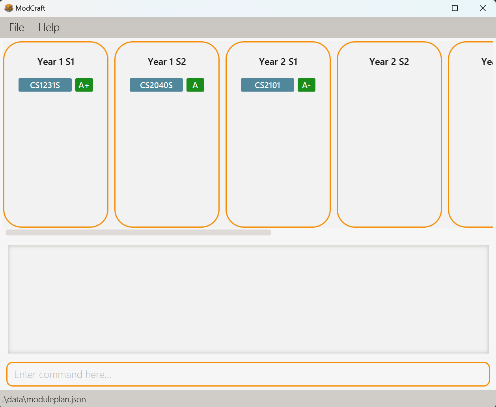

## ModCraft

This is **ModCraft**. 

ModCraft provides a fast and easy way for students to track courses to take to meet graduation requirements and plan courses to take.

Example usages:
* as a platform to plan and track your NUS modules
* as a way to keep track of your current progess in NUS,

The project is , optimized for users who prefer typing in CLI.
* It is **written in OOP fashion**
* It comes with a **reasonable level of user and developer documentation**.

This project is **currently ongoing** with the following features **implemented**:

* Viewing help
* Display Information about the module
* Add taken modules
* Delete taken modules
* Edit taken modules
* Calculate MC
* Calculate CAP

This project is based on the AddressBook-Level3 project created by the [SE-EDU initiative](https://se-education.org).

This project also pulls module data from the [NUSMods API](https://api.nusmods.com/v2/).
